# Zelp (Flutter)

Android app for Amazfit/Zepp accounts: Bluetooth pairing keys for
[Gadgetbridge](https://gadgetbridge.org/basics/pairing/huami-xiaomi-server/),
GPS assistance downloads, optional `gps_uihh.bin` build, firmware checks and
downloads, and Apps / Watchfaces browsing with install QR codes.

Based on [huami-token](https://codeberg.org/argrento/huami-token/). Firmware
and market flows follow the same Amazfit paths as
[Zepp Explorer](../explorer), with devices from
[ZeppOS-DevicesList](https://github.com/melianmiko/ZeppOS-DevicesList).

Xiaomi Mi Fitness login is not included.

## Disclaimer

Zelp is for **personal use only**. It is not affiliated with, endorsed by, or
connected to Zepp, Amazfit, Huami, or their parent companies. Zepp and Amazfit
are trademarks of their respective owners.

Zelp was mostly built with AI assistance. Review carefully before relying on
it; treat the codebase as experimental and verify behavior yourself.

## Why “Zelp”?

**Zelp** is a portmanteau of **Zepp** + **help**.

## Tabs

1. **GPS** — GPS packs and optional `gps_uihh.bin` (sign-in required)
2. **Watchfaces** — watchface list for a watch model (sign-in required)
3. **Apps** — apps list for a watch model (sign-in required)
4. **Firmware** — firmware history and downloads (no sign-in)

Account, pairing keys, and download folder live under **Settings** (gear icon
on every tab), not as a separate tab. On first launch you complete a short
setup: sign in, or continue without signing in.

GPS, Watchfaces, and Apps show a small lock mark and stay closed until you
sign in. Tapping them while signed out shows a snackbar. Firmware is open
without an account.

## Settings

- Sign in with Amazfit email + password (credentials are saved). Pairing-key
  fetch is optional — keys are shown in the UI to copy or share, not saved as
  a file.
- Or **Continue without signing in** to use Firmware only.
- Choose where downloads are saved; clear folder with a confirmation that shows
  the file count.
- Open Settings anytime from the gear in the app bar.

## GPS

Pick the GPS pack types you want. Building `gps_uihh.bin` uses temporary packs
in memory and only saves that file unless you also check those pack types.

## Firmware

Pick a watch (compact chooser). If a model has more than one hardware variant,
pick which one to check. Release notes appear when available. Downloads go to
your folder after confirmation; already-downloaded files are called out clearly.
Firmware checks query several Amazfit regions (`RU`, `CN`, `PL`, `US`) and merge
the OTA chains so region-staged rollouts show up as soon as any region has them.

## Apps & Watchfaces

- Choose a **watch model** (not a raw hardware channel). Lists are saved on
  this device and only update when you tap **Update list**.
- Filter and sort (category, author, price, starred, released, size, name).
  Release dates come from the market `updated_at` field when Zepp provides one.
- Tap an item for **About** / **What’s new**, download, star, **Show QR
  code** (Zepp developer-mode install: original Amazfit package URL with
  `https://…` → `zpkd1://…` for apps, `watchface://…` for watchfaces), and
  copy link.
- Downloading stars the item by default; starred updates appear at the top
  after a list refresh.
- Update list is incremental: it re-reads the market list, but skips re-fetching
  details for unchanged free items that already have download info and About text.
- Refresh queries several Amazfit market regions (`RU`, `CN`, `PL`, `US`, same
  set as Zepp Explorer) and merges the results, so region-gated apps/watchfaces
  still appear. Some features (e.g. Blood Pressure calibration) may still need
  an account registered in a supported country.

## Screenshots

<table>
  <tr>
    <td align="center">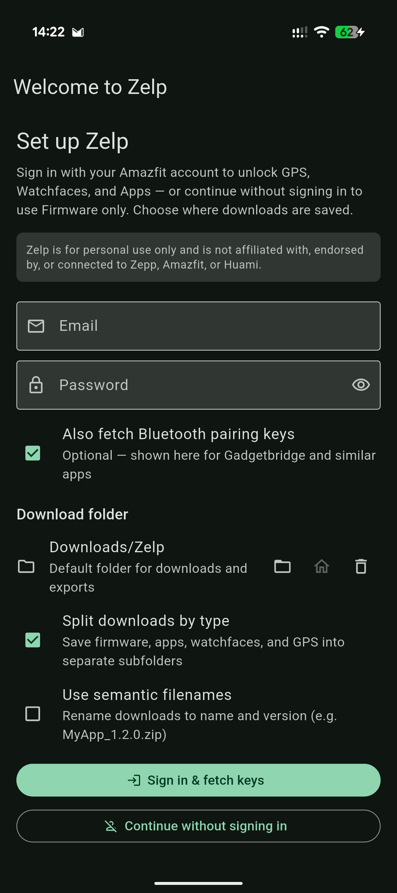<br/>Setup</td>
    <td align="center">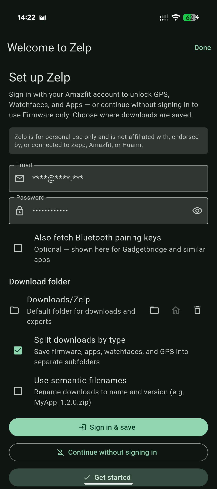<br/>Settings (signed in)</td>
  </tr>
  <tr>
    <td align="center">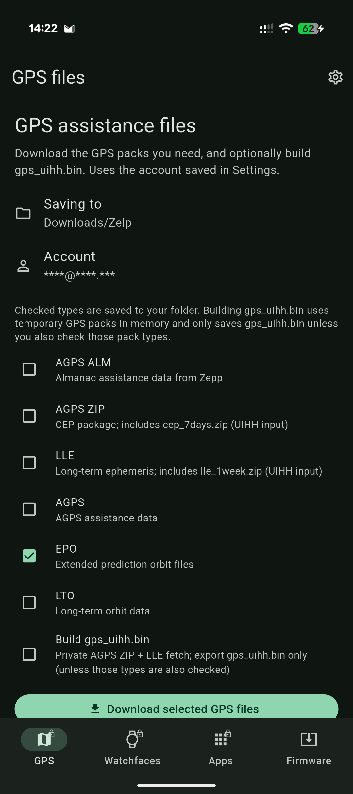<br/>GPS</td>
    <td align="center">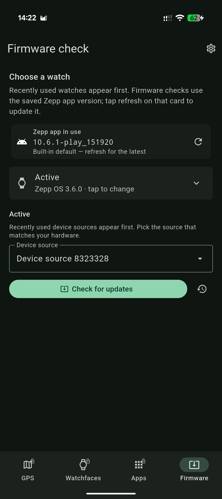<br/>Firmware</td>
  </tr>
  <tr>
    <td align="center">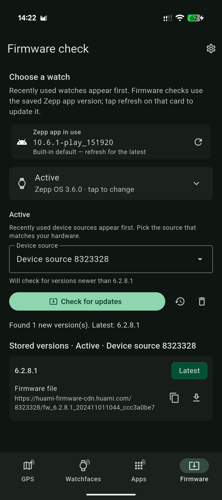<br/>Firmware history</td>
    <td align="center">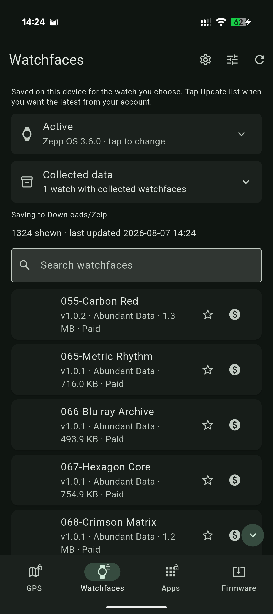<br/>Watchfaces</td>
  </tr>
  <tr>
    <td align="center">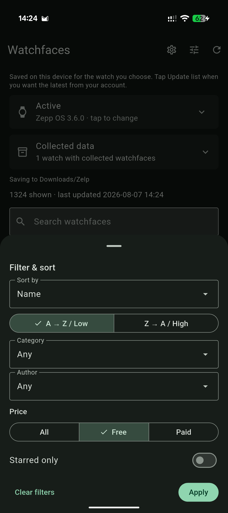<br/>Filter &amp; sort</td>
    <td align="center">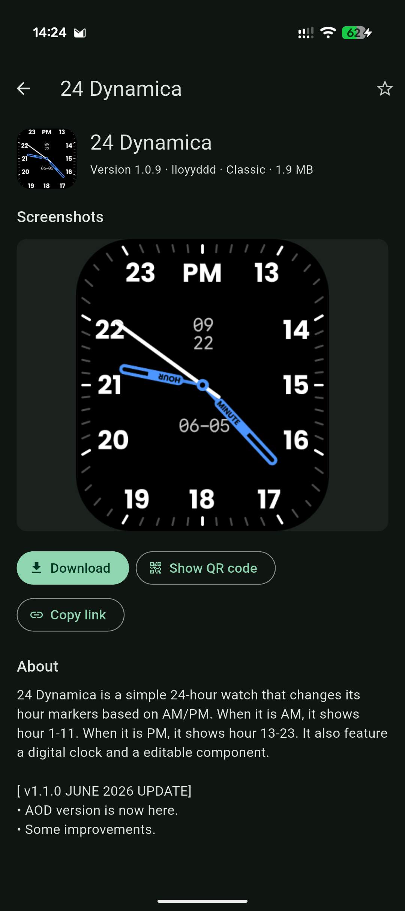<br/>Watchface detail</td>
  </tr>
  <tr>
    <td align="center">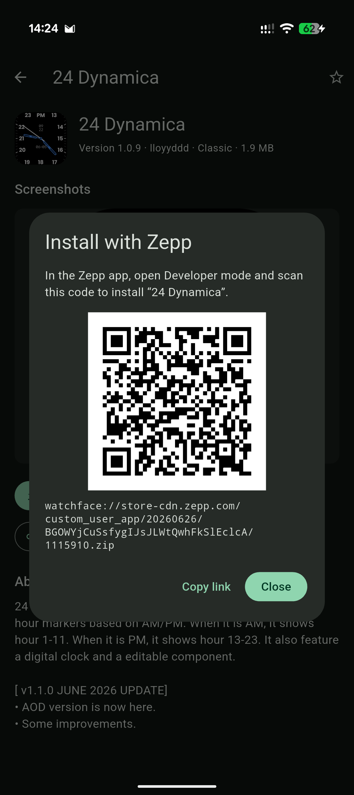<br/>Watchface QR</td>
    <td align="center">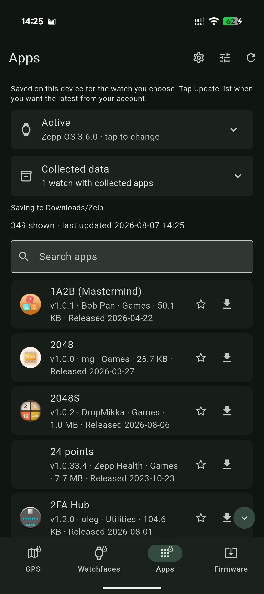<br/>Apps</td>
  </tr>
  <tr>
    <td align="center">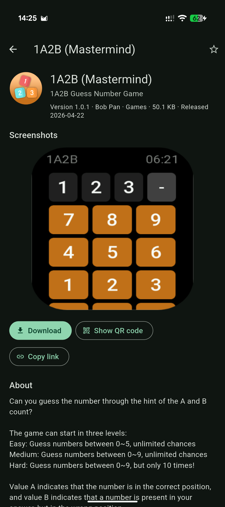<br/>App detail</td>
    <td align="center">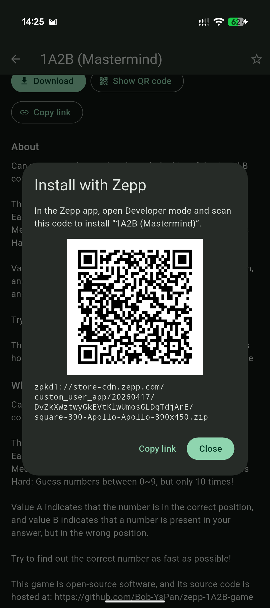<br/>App QR</td>
  </tr>
</table>

Refresh the PNGs with an attached Android device (copy `.env.example` to `.env`,
set `ZEPP_EMAIL` / `ZEPP_PASSWORD`):

```bash
./scripts/capture_screenshots.sh
```

Uses `flutter drive` + `--flavor screenshots` + `integration_test` (clears
`org.zelp.screenshots` first so the welcome setup screen is included). That
flavor installs as **Zelp Screenshots** beside a normal Zelp build. Pass
`--keep-data` to skip the clear. The integration test swaps credential fields /
stored account email to placeholders (`****@****.***` and a fixed bullet string)
for any shot that would otherwise show a real login.

## App icon

Custom Android launcher icon under `assets/icon/`.

## Requirements

- [FVM](https://fvm.app/) with Flutter `stable` (see `.fvmrc`)
- Android SDK (for device / APK builds)
- [uv](https://docs.astral.sh/uv/) (for ShellCheck via `uvx` in pre-commit / CI)
- [pre-commit](https://pre-commit.com/) (for local lint, outdated-deps check, and Conventional Commits hooks)

## Setup

```bash
fvm use
fvm flutter pub get
```

After `git worktree add`, run `./scripts/setup_worktree.sh` before any
Flutter/Dart/pre-commit work (see `AGENTS.md`). Prefer
`./scripts/run_fvm.sh …` over bare `fvm` so worktree `GIT_DIR` cannot
poison the shared SDK cache.

## Run

```bash
fvm flutter run --flavor prod
```

Screenshot / side-by-side debug installs use `--flavor screenshots`
(`org.zelp.screenshots`, launcher name “Zelp Screenshots”).

## Analyze / format

```bash
fvm dart format .
fvm flutter analyze
./scripts/analyze_kotlin.sh   # detekt (same rules as `cd android && ./gradlew :app:analyze`)
uvx --from shellcheck-py==0.11.0.1 shellcheck scripts/*.sh
```

## Test

```bash
fvm flutter test
```

Tests are unit-only (no real network). HTTP and file I/O are mocked or use
in-memory fixtures.

## Pre-commit hooks

Install hooks once after clone (formats/analyzes on commit; ShellCheck on shell
scripts; checks for outdated direct/dev pub dependencies; Conventional Commits
on `commit-msg`):

```bash
pre-commit install --hook-type pre-commit --hook-type commit-msg
```

There is no official [pre-commit](https://pre-commit.com/) framework hook for
`flutter pub outdated` (Flutter/Dart do not ship one either). The community
[`dart_pre_commit`](https://pub.dev/packages/dart_pre_commit) package has an
`outdated` task, but it is a Dart CLI wired through custom git scripts—not a
drop-in pre-commit repo—and would overlap this project's FVM format/analyze
hooks. Zelp uses a small local hook instead:

`scripts/check_pub_outdated.py` runs `fvm flutter pub outdated --json` and
**fails** when a direct or dev dependency:

- is discontinued, retracted, or affected by a security advisory, or
- has an **upgradable** version within current pubspec constraints
  (`current` ≠ `upgradable` — usually fixed by `fvm flutter pub upgrade`).

Transitive-only gaps and constraint-blocked majors (newer `resolvable`/`latest`
but not upgradable without editing constraints, and sometimes only via
prereleases) do not fail the hook.

Run against all files without committing:

```bash
pre-commit run --all-files
```

## Release build

```bash
fvm flutter build apk --release --flavor prod --split-per-abi
./scripts/check_no_google_libs.sh build/app/outputs/flutter-apk/app-prod-*-release.apk
```

`check_no_google_libs.sh` fails if proprietary Google Mobile Services libraries
(GMS / Firebase / ML Kit / Play) appear on the release classpath, or if an APK
still embeds Google Play’s encrypted Dependency metadata signing block. Release
builds opt out of that metadata in `android/app/build.gradle.kts`.

Publishing a GitHub Release runs `.github/workflows/release.yml`, which builds
per-ABI APKs, runs the same Google-library check, and uploads them as
`{app}-{version}-{abi}.apk` (for example `zelp-1.0.0-arm64-v8a.apk`). CI and
release workflows read the Flutter version from `.fvmrc`.

## License

Zelp is free software: you can redistribute it and/or modify it under the terms
of the [GNU General Public License](LICENSE) as published by the Free Software
Foundation, either version 3 of the License, or (at your option) any later
version.
